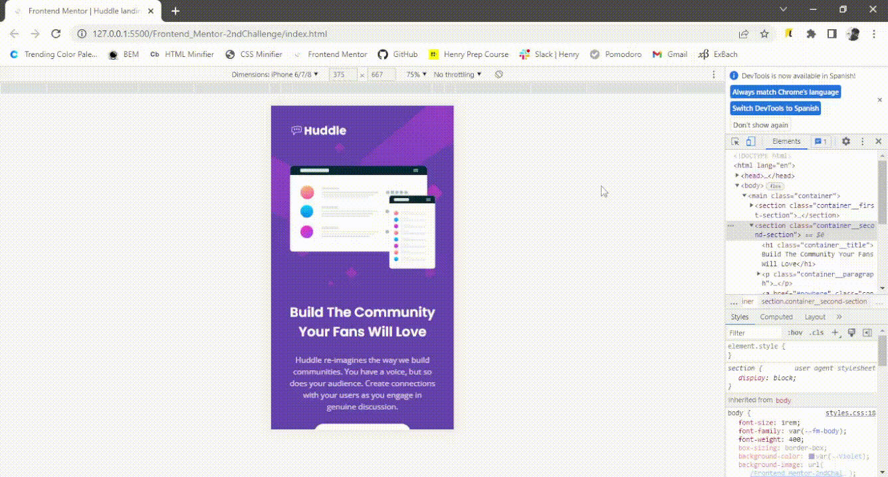

# Frontend Mentor - Huddle landing page with single introductory section solution

This is a solution to the [Huddle landing page with single introductory section challenge on Frontend Mentor](https://www.frontendmentor.io/challenges/huddle-landing-page-with-a-single-introductory-section-B_2Wvxgi0). Frontend Mentor challenges help you improve your coding skills by building realistic projects.

## Table of contents

- [Overview](#overview)
  - [The challenge](#the-challenge)
  - [Screenshot](#screenshot)
  - [Links](#links)
- [My process](#my-process)
  - [Built with](#built-with)
  - [Useful resources](#useful-resources)
- [Author](#author)

## Overview

### The challenge

Users should be able to:

- View the optimal layout for the page depending on their device's screen size
- See hover states for all interactive elements on the page

### Screenshot
📱 Mobile

💻 Desktop

### Links

- Solution URL: [https://www.frontendmentor.io/solutions/huddle-landing-page-with-a-single-introductory-section-solution-Lo92V3_sqx](https://www.frontendmentor.io/solutions/huddle-landing-page-with-a-single-introductory-section-solution-Lo92V3_sqx)
- Live Site Here: [https://fermop.github.io/huddle-landing-page-with-a-single-introductory-section/](https://fermop.github.io/huddle-landing-page-with-a-single-introductory-section/)

## My process

### Built with

- Semantic HTML5 markup
- CSS custom properties
  - Grid
  - Flexbox
- Mobile-first workflow
- BEM naming convention

### Useful resources

- [BEM](https://9elements.com/bem-cheat-sheet/) - What is BEM? BEM stands for Block, Element, and Modifier. It’s a CSS naming convention for writing cleaner and more readable CSS classes. BEM also aims to write independent CSS blocks in order to reuse them later in your project.
- [Normalize.css](https://necolas.github.io/normalize.css/) - This file makes browsers render all elements more consistently and in line with modern standards. It precisely targets only the styles that need normalizing.

## Author

- Frontend Mentor - [@fermop](https://www.frontendmentor.io/profile/fermop)
- Facebook - [Fernando Mojica](https://www.facebook.com/fernando.mojica.758737/)